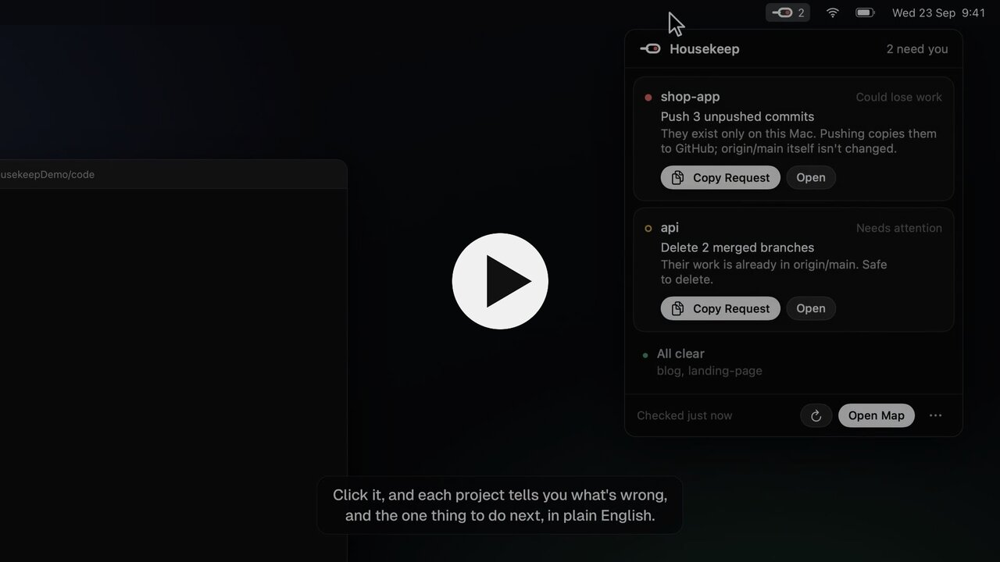
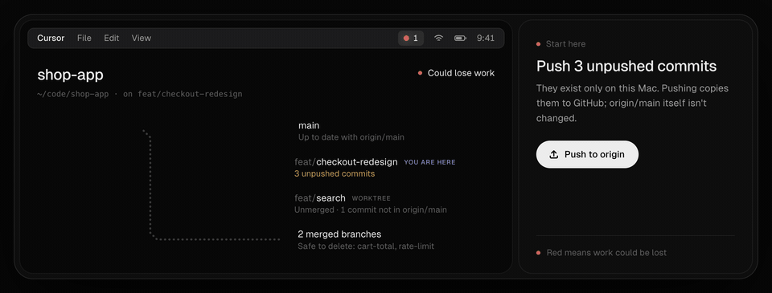

# Housekeep

Is your git work committed, pushed, in sync with main, and cleaned up? One command tells you, for every repo you've worked on recently, in git's own words with a plain-English explanation of each. A live visual map shows why, and every fix is a request you hand to your AI assistant.

```bash
npx git-housekeep
```

On a Mac, you can [download the app](https://github.com/Dammyjay93/housekeep/releases/latest/download/Housekeep.dmg) instead: a light in your menu bar, the map a click away, and no terminal needed.

[](https://housekeep.pages.dev/#watch)



```
  housekeep  ·  5 repos  ·  fetched 4 min ago

  ● portfolio    Could lose work
    → Remove a committed secret: .env
      secret committed  ·  1 unpushed  ·  1 ahead of origin/main

  ● shop-app     Could lose work
    → Push 3 unpushed commits
      3 uncommitted  ·  3 unpushed  ·  1 merged branch on origin

  ● api          Needs attention
    → Pull main (fast-forward)
      4 behind origin/main  ·  2 merged branches (2 local, 2 on origin)

  ● mobile-app   Needs attention
    → Review 1 stash
      1 stashed  ·  1 prunable worktree (folder deleted)

  ✓ blog         All clear

  2 could lose work  ·  2 need attention  ·  1 all clear

  Each fix is a request for your AI assistant: housekeep <repo> shows it, housekeep copy <repo> copies it.

  o open the map   q quit
```

Press `o` for the map: every repo's branches drawn like a transit map, with a request to copy for each fix.

Try it without touching anything of yours: `npx git-housekeep --demo` shows the report for five made-up projects, and `npx git-housekeep open --demo` opens the map.

## The Mac app

[Download Housekeep.dmg](https://github.com/Dammyjay93/housekeep/releases/latest/download/Housekeep.dmg), drag Housekeep to Applications and open it. It needs macOS 13 or later, runs on Apple silicon and Intel, and is signed and notarized by Apple.

- A light in your menu bar: red when work could be lost, amber when something needs attention, green when everything is committed, pushed and in sync.
- Click it for each project's next step, with **Copy request** for your AI assistant, and **Open map** for the whole picture.
- It can start at login. It carries its own Node, so there's nothing else to install, and like the command line it only reads your repos.

If your menu bar is full, macOS can hide the light behind the camera notch. Opening Housekeep again from Applications brings up a window with the way to the map.

## The four checks

| Check | Clean when |
| --- | --- |
| **Working tree** | No uncommitted changes, stashes, half-finished merges or rebases, or password-looking files git isn't ignoring. |
| **Push** | No unpushed commits: everything is on the remote, so losing this computer loses nothing. |
| **Sync** | Your `main` is up to date with `origin/main`, the source of truth. |
| **Cleanup** | No merged branches left locally or on the remote, and no stale worktrees. |

Every term in the report and the map has a "?" beside it that explains it, so you learn the words git, GitHub and your AI assistant all use.

## Usage

`npx git-housekeep` runs it once. To keep it, `npm install -g git-housekeep` gives you the `housekeep` command (and `git housekeep`, since git runs any `git-*` command on your path).

```
housekeep               Check every repo you've worked on recently
housekeep <path>        Check one repo in detail (e.g. housekeep .)
housekeep copy <path>   Copy that repo's request for your AI assistant
housekeep serve         Run the live map in this terminal
housekeep open          Open the live map in your browser
housekeep install       macOS: keep the live map running from login, with a menu bar light (SwiftBar; the Mac app does this on its own)
housekeep uninstall     macOS: undo housekeep install

--json                  The full result as JSON, for scripts and AI assistants
--fetch                 Fetch from every remote now, whatever the schedule
--offline               Don't touch the network
--port <n>              Port for the live map (default 47219)
--demo                  Try it on made-up projects: nothing on your computer is read or changed
```

Exit codes: `0` all clear, `1` needs attention, `2` could lose work, `3` couldn't check. So `npx git-housekeep . || echo "not clean"` works in scripts, and an AI assistant can run `npx git-housekeep . --json` before it says it's done.

Needs Node 20 or newer and git 2.25 or newer (2.38 or newer to recognise squash merges; older versions say so). It has no dependencies.

For GitHub repos, install and log in to the [GitHub CLI](https://cli.github.com) (`gh auth login`). Housekeep then also knows which branches are protected, which have open pull requests, a fork's parent and the real default branch. Without it everything still works, but branches are judged by name alone, and the map says so.

## For AI assistants

Housekeep is built to be run by your assistant as much as by you: `--json` gives every repo's state, its next step, and every request (`next.ask`, and one per branch, remote branch and worktree in `requests`), in plain words with the checks each change needs.

**Any assistant:** install the Housekeep skill with [skills.sh](https://skills.sh). It works with Claude Code, Cursor, Codex, GitHub Copilot and others, and your assistant then checks with Housekeep when you ask whether your work is safe, before a deploy or a break, and before it tells you a task is done. It acts on the requests only with your OK.

```bash
npx skills add Dammyjay93/housekeep
```

**Claude Code, without skills.sh:** `npx git-housekeep skill` installs the same skill.

**Or, in any assistant's instructions:** add this to your project's `AGENTS.md`, or your assistant's rules or custom instructions:

> Before telling me a task is done, and whenever I ask whether my work is safe, run `npx -y git-housekeep . --json`. If `tier` isn't `safe`, tell me `next.title` and `next.why` in plain words and offer to do what `next.ask` says, following its checks. Only act with my OK. Never force-push, and never push `main` directly.

## How it decides

- **The source of truth is `main` on the remote**, not your local copy. `main` is whatever the remote calls its default branch, so `master`, `trunk` and renamed defaults work.
- **In a fork**, `main` is compared with the project you forked from, while your branches and pushes go to your own copy.
- **A branch is merged when all of its changes are in `main`**, including squash and rebase merges. If merging it into `main` would change nothing, it's merged.
- **Some branches are never suggested for deletion**, whatever they contain:
  - the default branch
  - protected branches
  - branches with an open pull request, or that pull requests are based on
  - long-lived names like `develop`, `staging`, `production`, `release/*` and `gh-pages`
- **When it can't see everything, it says so** instead of showing green: shallow clones, single-branch clones, unreachable remotes, and folders your operating system won't let it read (like `~/Documents` on macOS, until you allow your terminal).

## It only reads

Housekeep never commits, pushes, merges, deletes or changes a setting in your repos. Every fix is a **request**: plain English you copy from the map, the report's JSON or the menu bar, and paste into your AI coding assistant (Claude Code, Cursor, Codex) opened in that project. Your assistant does the work where you can see it, and Housekeep notices when it's done.

Each request carries the checks the change needs, so your assistant makes them before touching anything:
- Only delete a branch whose changes are all in `main` on the remote (squash merges count), and never one that's checked out.
- On the remote, fetch first, and skip any branch that has moved since, is protected, or has an open pull request.
- Commits on `main` that aren't on the remote go to a branch of their own, never to `main`, because pushing `main` can put a site live.
- Never force-push.

Two things touch git without you asking:

- **It fetches.** Every `fetchEveryMinutes` (default 10) it runs `git fetch --prune` for the remotes that matter, plus `git ls-remote` to learn the default branch.
  - That updates git's record of the remote, never your branches or files, and forgets branches deleted there. When one of those held work that isn't in `main`, Housekeep notes its last commit in its own state (not in your repo), so a request can bring it back while git still has it.
  - It runs without a terminal, so it can't stop to ask for an SSH passphrase. A hardware key or 1Password's SSH agent may still ask you to approve.
  - Use `--offline`, or set `fetchEveryMinutes` to `0`, to fetch only when you ask.
- **The squash-merge check writes temporary objects** into the repo. Nothing refers to them, and git's normal cleanup removes them.

The map can also open a project's folder in Finder, Terminal, VS Code or Cursor. Nothing leaves your computer except git's own traffic with your remotes, and GitHub's API when `gh` is installed. There's no telemetry.

The map only listens on `127.0.0.1`, and every request to it needs a token from the page it served, so other websites can't use it.

## Settings

`~/.config/housekeep/config.json`, created on first run:

- `roots`, `maxDepth`: where to look for repos (default your home folder, 4 levels deep).
- `activeDays`: watch repos you've committed to or switched branches in during this many days (default 45).
- `watch`: folders to always watch, however old. `ignore`: folders never to watch.
- `fetchEveryMinutes`: how often to fetch (default 10; `0` means only when you ask).
- `port`: where the map listens (default 47219; any free port if it's taken).

State (the last result, what the remotes said) lives in `~/.local/state/housekeep`.

## Fonts

The map uses [Geist](https://vercel.com/font) (SIL Open Font License, `assets/fonts/OFL-Geist.txt`). To use your own font, put its files in `~/.config/housekeep/fonts` with a `faces.json`:

```json
{ "faces": [{ "file": "Mine-Regular.otf", "weight": "400" }, { "file": "Mine-Medium.otf", "weight": "500" }], "labelLift": "0px" }
```

## Development

```bash
npm install
npm test
node dist/src/cli.js
```

The tests build throwaway repos, each with a local bare repo standing in for the remote.

The demo (`--demo`, and the website's live map) is built from scripted throwaway repos by the real scanner: `npm run demo:build` regenerates `assets/demo.json`.

The Mac app is in `mac/`, in SwiftUI. `mac/build.sh` builds it (needs Xcode and XcodeGen) with Node and Housekeep inside; `mac/build.sh --release` signs it with a Developer ID, notarizes it and packs the `.dmg`.

The website is plain HTML in `site/`. `npm run site:build` adds the live demo page, the fonts, and the terminal report from the demo. It's served by Cloudflare Pages at [housekeep.pages.dev](https://housekeep.pages.dev): `npm run site:build && npx wrangler pages deploy` publishes it.

## License

MIT
